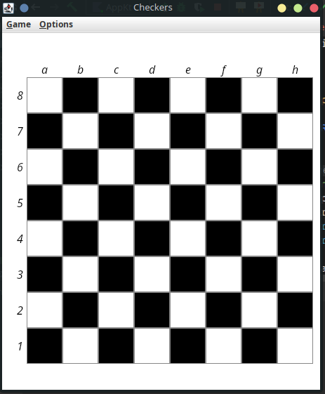
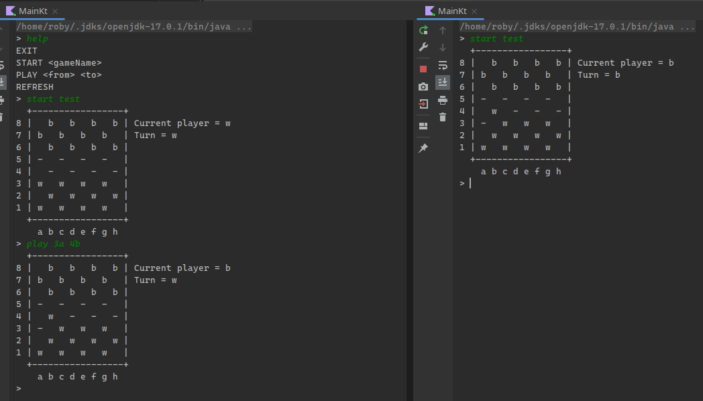

# Checkers game

- Checkers game in kotlin
- GUI done with jetback compose (playing without gui in console is also possible)
- Storage through file or mongo DB (async also)
- Remote multiplayer is possible (change `CONNECTION_STRING` constant to a valid MongoDB connection string)
- You can still play 2 players on the same computer by using file storage

Some images (the project is way better but im too lazy to setup and show off everything)

## Authors
- André Gonçalves (a49464@alunos.isel.pt)
- Roberto Petrisoru (a49418@alunos.isel.pt)
- Danilo Vieira (a49988@alunos.isel.pt)
